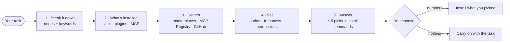

<div align="center">


# skill-scout

**Know what to install — before you install it.**

A Claude Code plugin that picks the skills, plugins and MCP servers your task actually needs,<br>
then checks who wrote them, how fresh they are and what they can do on your machine.

[](https://github.com/Jokesflow/skill-scout/actions/workflows/ci.yml)
[](LICENSE)
[](https://code.claude.com/docs/en/plugins/install)
[](skills/skill-scout/scripts/scout.py)
[](skills/skill-scout/scripts/scout.py)

**English** · [Русский](README.ru.md)

</div>

---

## Why

Choosing tools for Claude is a supply-chain decision. Plugin catalogs list thousands of
plugins, the MCP Registry keeps growing, and a popular product name can match dozens of
listings (`figma` matches 28). A plugin can run shell commands through hooks, start local MCP
servers with your user rights or put executables on your `PATH`.

skill-scout does the legwork and shows you the risk **before** you say yes:

- **Knows what you already have** — installed skills, plugins, MCP servers and claude.ai
  connectors — and never suggests a duplicate.
- **Searches where tools actually live** — your marketplaces plus Anthropic's official,
  community, agent-skills and knowledge-work catalogs (even ones you haven't added), the
  official MCP Registry, claude.ai connectors and GitHub.
- **Vets every candidate** — the vendor's own repo or a lookalike, the last update, hooks,
  local processes, executables, pre-approved tools, tokens and OAuth.
- **Answers short** — at most five recommendations, each with a link and an exact install
  command, plus what is already covered and what nothing covers.
- **Never installs on its own** — you pick the numbers.
- **Doesn't make things up** — every name, link, version and command comes from tool output in
  that session; a source that failed is reported, not papered over.

## Quick start

In Claude Code:

```text
/plugin marketplace add Jokesflow/skill-scout
/plugin install skill-scout@skill-scout
```

Then just start a task — *"I need a landing page from our Figma mockup, deployed to
Vercel"* — and skill-scout steps in. Or ask directly:

```text
/scout landing page from a Figma mockup, deployed to Vercel
```

> [!NOTE]
> On the first run Claude Code asks `Use skill "skill-scout:skill-scout"?`. It does that for
> every skill that pre-approves tools; this one pre-approves only read-only discovery
> ([details](#trust-and-safety)). Choose **Yes, and don't ask again**, or allow it everywhere
> in `~/.claude/settings.json`:
>
> ```json
> { "permissions": { "allow": ["Skill(skill-scout:skill-scout)"] } }
> ```

## What you get

A real answer from Claude Code 2.1.291 on an account with claude.ai connectors. Only cuts,
marked with `…`:

> **I'm launching a SaaS product next month: I need social media posts, an SEO audit of our
> landing page and a weekly analytics report. Which skills, plugins or MCP servers should I set
> up?**

```markdown
**Already available**
- **marketing** (plugin, enabled on your claude.ai account): content creation, campaign
  planning, brand voice and performance reporting. This covers the social posts and the
  report format.
- **WebFetch** (built in): can read your landing page and check titles, meta tags, headings,
  links and structured data. That's enough for an on-page SEO audit with no extra tool.

**Worth installing**
1. **Supermetrics Marketing Analytics** · MCP connector. It gives the weekly report real data.
   Per its directory listing, it pulls Google Analytics, Google Ads, Facebook Ads, TikTok,
   LinkedIn, Instagram, YouTube and 200+ other sources through one connection.
   Connect it in Settings → Connectors → Supermetrics.
   ⚠ It needs sign-in to your analytics and ad accounts. I couldn't check the OAuth scopes or
   pricing. … look at the consent screen before approving.

2. **Ubersuggest** · MCP connector. It adds live data to the SEO audit: site audits, keyword
   research, competitors, backlinks and AI-search visibility. …
   ⚠ It needs an Ubersuggest account. … OpenRush is a similar connector, so pick one of the two.

3. **Metricool Social Media Management** · MCP connector. It schedules posts, suggests the best
   time to post per network and returns social analytics, which also feeds the weekly report. …
   ⚠ It can publish to your social accounts, so approve only the networks you need. …

**Not found**
- **Free option for GA4:** I found several GA4 MCP servers, for example
  `dev.anacraft/google-analytics-ga4`. I couldn't check their repositories (GitHub access was
  blocked in this session), so I'm not recommending one. The no-tool route is to export GA4 or
  Search Console as CSV each week and have me turn it into the report.

Which ones should I install? Reply with the numbers — nothing gets installed without your confirmation.
```

Ask in another language and you get the answer in that language — the eval suite runs in
English and Russian.

## How it works



When skill-scout triggers by itself at the start of a task, it runs a **quick mode**: at most
three searches, and a single line ("no extra tools needed") when nothing is worth installing.
It stays quiet on small edits and quick questions.

| Where it looks | How |
| --- | --- |
| What you already have | Skills and MCP tools in Claude's context, `claude plugin list`, `claude mcp list`; `ListSkills`, `ListPlugins`, `ListConnectors` on claude.ai and in Cowork |
| Plugins and skill bundles | Your marketplaces (`claude plugin list --available --json`) and Anthropic's `claude-plugins-official`, `claude-community`, `anthropic-agent-skills`, `knowledge-work-plugins` |
| MCP servers | The official [MCP Registry](https://registry.modelcontextprotocol.io) and claude.ai connectors (`SearchMcpRegistry`) |
| Everything else | GitHub search, with web search as a fallback |

## Trust and safety

- **Nothing is installed, enabled or connected** until you pick it. Then you run
  `/plugin install …` yourself, or Claude runs `claude plugin install …` or `claude mcp add …`
  for you and leaves a placeholder for any token, so secrets never go through the chat.
- **Pre-approved for one turn only**, and only for discovery: its own script
  (`python3 …/scripts/scout.py`), `claude plugin list`, `claude mcp list`, `WebSearch`, and
  `WebFetch` for `registry.modelcontextprotocol.io`, `raw.githubusercontent.com`, `github.com`
  and `claude.com`.
- **Network:** read-only HTTPS to the MCP Registry, `raw.githubusercontent.com` and
  `api.github.com`; a blob-less `git fetch` into a temp directory when the GitHub API is rate
  limited. A `GH_TOKEN` is sent only to `api.github.com`. No telemetry. See [SECURITY.md](SECURITY.md).

What `scout.py inspect` flags before you install a plugin:

| Finding | Why it matters |
| --- | --- |
| ⚠ Hooks | Shell commands that run on events — every session start, every tool call — outside the sandbox |
| ⚠ Mods (`modules` in `hooks.json`) | JavaScript inside Claude Code with file, process and network access |
| ⚠ Local MCP servers | A process with your user rights (`npx`, `uvx`, `docker`…) |
| • Remote MCP servers | Your data goes to that service; tokens and OAuth scopes listed |
| ⚠ `bin/` executables | Added to the `PATH` of Claude's shell |
| ⚠ Broad `allowed-tools` | Bare `Bash`, `Write`, `Edit` or `Bash(python3 *)` run without asking |
| • `userConfig` secrets, dependencies | What the plugin will ask you for and what it pulls in |
| Freshness and author | Last change, stars, license, archived repos, vendor vs. lookalike |

Real output for the Vercel plugin from the official marketplace:

```text
$ python3 scripts/scout.py inspect vercel@claude-plugins-official
Source: github.com/vercel/vercel-plugin @ 882e66c26986
Revision date (git): 2026-09-21
Manifest: vercel v0.50.0 · author Vercel · license Apache-2.0
Components: 37 skills (access-protected-vercel-deployment, ai-gateway, ai-sdk, …), 5 commands, 3 agents, 111 bundled code files
Permissions and reach:
  ⚠ hook SessionStart[startup|resume|clear|compact] command: node "${CLAUDE_PLUGIN_ROOT}/hooks/session-start-seen-skills.mjs"
  ⚠ hook SessionStart[startup|resume|clear|compact] command: node "${CLAUDE_PLUGIN_ROOT}/hooks/session-start-profiler.mjs"
  ⚠ hook SessionStart[startup|resume|clear|compact] command: node "${CLAUDE_PLUGIN_ROOT}/hooks/inject-claude-md.mjs"
  ⚠ hook PostToolUse[Skill] command: node "${CLAUDE_PLUGIN_ROOT}/hooks/posttooluse-skill-telemetry.mjs"
  ⚠ hook SessionEnd[*] command: node "${CLAUDE_PLUGIN_ROOT}/hooks/session-end-cleanup.mjs"
  • remote MCP vercel (http): https://mcp.vercel.com — data goes to this service
```

## The helper script

[`scout.py`](skills/skill-scout/scripts/scout.py) is read-only, uses the Python 3.8+ standard
library only, and also works on its own:

| Command | What it does |
| --- | --- |
| `inventory` | Installed plugins, MCP servers and skills in `~/.claude/skills` and `.claude/skills` |
| `plugins <keywords>…` | Ranked search across catalogs: marketplace tier, version, installs, repository, install command |
| `mcp <keywords>…` | MCP Registry search: publisher (verified domain or GitHub account), remote or package, required secrets, a `claude mcp add` line |
| `github <keywords>… [--kind skill\|plugin\|mcp]` | Repository search: stars, last push, license, owner type |
| `inspect <name@marketplace \| github-url \| owner/repo \| registry-name \| dir>` | Components, permissions and freshness of one candidate |

```bash
python3 skills/skill-scout/scripts/scout.py mcp figma vercel
python3 skills/skill-scout/scripts/scout.py inspect figma@claude-plugins-official
```

Set `GH_TOKEN` or `GITHUB_TOKEN` to raise GitHub API limits.

## Test prompts

The same cases live in [`evals/`](evals) for `claude plugin eval`.

| Case | Prompt | Expected |
| --- | --- | --- |
| Design | «Хочу сверстать лендинг по макету из Figma на Next.js и задеплоить его на Vercel. Что мне для этого нужно из скиллов, плагинов и MCP?» | Triggers by itself. Recommends Figma's own plugin (remote MCP `mcp.figma.com`, OAuth); for Vercel, the plugin with a ⚠ about its 5 hooks or the lighter remote MCP. Deploying needs no extra tool. |
| Code | «Пишу REST API на FastAPI с PostgreSQL: нужны миграции, тесты и ревью кода перед PR…» | `/code-review` and built-in Bash as already available; GitHub plugin, a Python LSP or quality gate, an MCP server or connector for the database with a ⚠ about write access. No plugin needed for Alembic. |
| Research | `/scout ресёрч рынка AI-ассистентов для юристов: свежие источники, научные статьи и итоговый отчёт в PDF` | `/scout` hands off to the skill. Web search and a PDF skill as available; a paper-search tool with warnings about its author or local process. |
| Marketing | "I'm launching a SaaS product next month: social posts, an SEO audit of our landing page and a weekly analytics report…" | An English answer with English headings; covers all three needs. |
| Negative | «Переименуй в этом фрагменте переменную x в total…» | skill-scout stays out of the way. |

## Development

```bash
claude --plugin-dir .                       # load the plugin for one session
claude plugin validate . --strict           # marketplace, manifest and skills
python3 -m unittest discover -s tests       # offline tests, no network
claude plugin eval . --judge-model sonnet --allow-tools "Bash(python3 *)" WebSearch \
  "WebFetch(domain:registry.modelcontextprotocol.io)" \
  "WebFetch(domain:raw.githubusercontent.com)" "WebFetch(domain:api.github.com)"
```

`claude plugin eval` runs every case three times with and three times without the plugin and
uses your plan's limits; for a single run add `--case <name> --runs 1 --ablation none`. Granting
Bash in evals needs a sandbox backend (`bubblewrap` and `socat` on Linux). CI runs the unit
tests on Python 3.8 and 3.13 and `claude plugin validate --strict` on every pull request.

```text
skill-scout/
├── .claude-plugin/
│   ├── plugin.json              # plugin manifest
│   └── marketplace.json         # this repo is also its own marketplace
├── skills/
│   ├── skill-scout/
│   │   ├── SKILL.md             # triggers, the five steps, answer format
│   │   ├── references/          # sources and fallbacks, vetting rubric
│   │   └── scripts/scout.py     # read-only helper
│   └── scout/SKILL.md           # the /scout command
├── evals/                       # claude plugin eval cases
├── tests/                       # offline unit tests
└── assets/                      # banner, social preview, icon
```

`/scout` is a skill with `disable-model-invocation: true` rather than a file in `commands/`,
because the Claude Code docs call commands the older format. The main skill is
`user-invocable: false`, so the `/` menu shows a single command. Context cost from
`claude plugin details`: about 300 tokens always on, about 3k when the skill runs.

## FAQ

<details>
<summary><b>Does it work on claude.ai or in Cowork?</b></summary>

The skill works wherever plugin skills load. There it prefers the built-in `SearchPlugins`,
`SearchMcpRegistry`, `SearchSkills` and `List*` tools when they are present. The helper script
needs a shell; without one, the skill falls back to WebFetch and WebSearch.
</details>

<details>
<summary><b>Will it slow down every task?</b></summary>

No. It triggers on new, substantial tasks and on "what do I need" questions, not on small edits
or follow-ups, and when it triggers by itself it runs the quick mode described above.
</details>

<details>
<summary><b>Can I run it headless, with <code>claude -p</code> or in CI?</b></summary>

Yes, but pass the grants yourself. In Claude Code 2.1.291 headless runs don't carry a skill's
`allowed-tools` over to later model requests, so add, for example:
`--allowedTools "Skill(skill-scout:skill-scout)" "Bash(python3 *)" WebSearch`.
</details>

<details>
<summary><b>Why does the MCP search sometimes come back empty?</b></summary>

The official registry matches server names only, so keywords should be product names
(`figma`, `postgres`, `notion`). When the registry times out, skill-scout says so and falls
back to claude.ai connectors, plugins that bundle a server, GitHub and web search.
</details>

## Limitations

- Without a token the GitHub API allows 10 searches a minute and 60 other requests an hour;
  `inspect` uses up to three per candidate.
- Cloud sessions on claude.ai/code don't load plugins installed on your machine.
- Recommendations are only as good as the catalogs: skill-scout checks the signals above, but
  it doesn't audit third-party code line by line. Read the hooks before you trust them.

## License

[MIT](LICENSE) © 2026 Jokesflow. The banner uses a subset of
[JetBrains Mono](https://github.com/JetBrains/JetBrainsMono) (SIL Open Font License 1.1).
