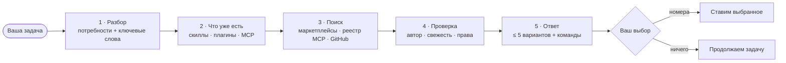

<div align="center">



# skill-scout

**Узнай, что ставить, — до того как поставишь.**

Плагин для Claude Code: подбирает скиллы, плагины и MCP-серверы, которые реально нужны задаче,<br>
и проверяет, кто их написал, когда обновлял и что они смогут делать на вашей машине.

[](LICENSE)
[](https://code.claude.com/docs/en/plugins/install)
[](skills/skill-scout/scripts/scout.py)
[](skills/skill-scout/scripts/scout.py)

[English](README.md) · **Русский**

</div>

---

## Зачем

Выбор инструментов для Claude — это вопрос цепочки поставок. В каталогах тысячи плагинов,
реестр MCP растёт, а популярное название совпадает с десятками записей (`figma` — 28).
Плагин может запускать shell-команды через хуки, поднимать локальные MCP-серверы с вашими
правами или класть исполняемые файлы в `PATH`.

skill-scout делает поиск за вас и показывает риски **до** того, как вы скажете «да»:

- **Знает, что уже есть:** установленные скиллы, плагины, MCP-серверы и коннекторы claude.ai —
  и не предлагает дубликаты.
- **Ищет там, где инструменты живут:** ваши маркетплейсы и каталоги Anthropic (официальный,
  community, agent-skills, knowledge-work), даже не добавленные; официальный реестр MCP,
  коннекторы claude.ai и GitHub.
- **Проверяет каждого кандидата:** вендор или подделка, дата обновления, хуки, локальные
  процессы, исполняемые файлы, заранее разрешённые инструменты, токены и OAuth.
- **Отвечает коротко:** до пяти рекомендаций со ссылкой и точной командой установки, плюс что
  уже закрыто и что ничем не закрыть.
- **Сам ничего не ставит:** вы называете номера.
- **Не выдумывает:** названия, ссылки, версии и команды — только из вывода инструментов в
  этой сессии; упавший источник называется прямо.

## Быстрый старт

В Claude Code:

```text
/plugin marketplace add Jokesflow/skill-scout
/plugin install skill-scout@skill-scout
```

Дальше просто начните задачу — *«нужен лендинг по макету из Figma с деплоем на Vercel»* —
и skill-scout подключится сам. Или спросите напрямую:

```text
/scout лендинг по макету из Figma, деплой на Vercel
```

> [!NOTE]
> При первом запуске Claude Code спросит `Use skill "skill-scout:skill-scout"?`. Так он делает
> для любого скилла, который заранее разрешает себе инструменты; этот разрешает только поиск
> ([подробнее](#безопасность)). Выберите **Yes, and don't ask again** или разрешите скилл
> везде в `~/.claude/settings.json`:
>
> ```json
> { "permissions": { "allow": ["Skill(skill-scout:skill-scout)"] } }
> ```

## Что вы получите

Реальный ответ Claude Code 2.1.291, только с сокращениями (`…`):

> **Хочу сверстать лендинг по макету из Figma на Next.js и задеплоить его на Vercel. Что мне
> для этого нужно из скиллов, плагинов и MCP?**

```markdown
**Уже есть и пригодится**
- **Bash и правка файлов**: создать проект (`npx create-next-app`), написать компоненты,
  прогнать сборку. Для самой вёрстки отдельный плагин не нужен.

**Стоит поставить**
1. **figma** · плагин (скиллы и удалённый MCP) — читает макет: структуру, стили, переменные,
   скриншоты. Есть скилл `figma-design-to-code`, который переводит макет в код.
   github.com/figma/mcp-server-guide · автор Figma, ревизия от 2026-09-22, официальный каталог,
   188.3k установок
   `/plugin install figma@claude-plugins-official`
   Данные уходят на `https://mcp.figma.com/mcp`. Нужна авторизация в Figma через `/mcp`.
   Хуков и локальных процессов нет.

2. **vercel** · плагин (скиллы, команды, агенты и удалённый MCP) — деплой, статус сборок,
   логи, домены, переменные окружения.
   github.com/vercel/vercel-plugin · автор Vercel, ревизия от 2026-09-21, лицензия Apache-2.0,
   официальный каталог, 285.4k установок
   `/plugin install vercel@claude-plugins-official`
   ⚠ Плагин запускает `node`-скрипты через хуки на каждый старт сессии, после вызова скилла
   и при завершении. … Если хуки не нужны, можно вместо плагина подключить только
   MCP-коннектор Vercel через Settings → Connectors. …

**Не найдено**
- Отдельного скилла по Next.js от вендора я не нашёл. … Лучшие практики Next.js (App Router,
  `next/image`, `next/font`) Claude знает и без него.

Что поставить? Напиши номера — без твоего подтверждения ничего не устанавливаю.
```

На английский вопрос — ответ на английском с английскими заголовками.

## Как это работает



Когда skill-scout срабатывает сам в начале задачи, он работает в **быстром режиме**: не больше
трёх поисков и одна строка («доп. инструменты не нужны»), если ставить нечего. На мелкие правки
и короткие вопросы он не реагирует.

| Где ищет | Как |
| --- | --- |
| Что уже есть | Скиллы и MCP-инструменты в контексте Claude, `claude plugin list`, `claude mcp list`; на claude.ai и в Cowork — `ListSkills`, `ListPlugins`, `ListConnectors` |
| Плагины и наборы скиллов | Ваши маркетплейсы (`claude plugin list --available --json`) и каталоги Anthropic `claude-plugins-official`, `claude-community`, `anthropic-agent-skills`, `knowledge-work-plugins` |
| MCP-серверы | Официальный [реестр MCP](https://registry.modelcontextprotocol.io) и коннекторы claude.ai (`SearchMcpRegistry`) |
| Всё остальное | Поиск по GitHub, запасной путь — веб-поиск |

## Безопасность

- **Ничего не ставится, не включается и не подключается**, пока вы не выбрали. Дальше вы сами
  запускаете `/plugin install …`, или Claude выполняет `claude plugin install …` либо
  `claude mcp add …` за вас — с плейсхолдером вместо токена, чтобы секреты не шли через чат.
- **Заранее разрешено только на один ход** и только для поиска: свой скрипт
  (`python3 …/scripts/scout.py`), `claude plugin list`, `claude mcp list`, `WebSearch` и
  `WebFetch` для `registry.modelcontextprotocol.io`, `raw.githubusercontent.com`, `github.com`
  и `claude.com`.
- **Сеть:** только чтение по HTTPS из реестра MCP, `raw.githubusercontent.com` и
  `api.github.com`; если GitHub API упёрся в лимит — `git fetch` без содержимого файлов во
  временную папку. `GH_TOKEN` уходит только на `api.github.com`. Телеметрии нет. См.
  [SECURITY.md](SECURITY.md).

Что `scout.py inspect` показывает до установки плагина:

| Находка | Почему важно |
| --- | --- |
| ⚠ Хуки | Shell-команды на события — каждый старт сессии, каждый вызов инструмента — вне песочницы |
| ⚠ Моды (`modules` в `hooks.json`) | JavaScript внутри Claude Code с доступом к файлам, процессам и сети |
| ⚠ Локальные MCP-серверы | Процесс с вашими правами (`npx`, `uvx`, `docker`…) |
| • Удалённые MCP-серверы | Данные уходят в этот сервис; видны нужные токены и OAuth |
| ⚠ `bin/` | Исполняемые файлы в `PATH` для Bash |
| ⚠ Широкие `allowed-tools` | Голые `Bash`/`Write`/`Edit`, `Bash(python3 *)`, `Bash(npx *)`, `Edit(/**)`… выполняются без вопроса |
| ⚠ Хуки во frontmatter скилла | Регистрируются, пока скилл работает |
| • Секреты в `userConfig`, зависимости | Что плагин попросит и что подтянет за собой |
| Свежесть и автор | Дата изменения, звёзды, лицензия, архивные репозитории, вендор или подделка |

## Скрипт scout.py

[`scout.py`](skills/skill-scout/scripts/scout.py) только читает, использует лишь стандартную
библиотеку Python 3.8+ и работает и сам по себе:

| Команда | Что делает |
| --- | --- |
| `inventory` | Установленные плагины, MCP-серверы и скиллы в `~/.claude/skills` и `.claude/skills` |
| `plugins <kw>…` | Ранжированный поиск по каталогам: тир каталога, версия, установки, репозиторий, команда установки |
| `mcp <kw>…` | Поиск в реестре MCP: издатель (подтверждённый домен или аккаунт GitHub), удалённый сервер или пакет, нужные секреты, строка `claude mcp add` |
| `github <kw>… [--kind skill\|plugin\|mcp]` | Поиск репозиториев: звёзды, последний push, лицензия, тип владельца |
| `inspect <name@marketplace \| github-url \| owner/repo \| имя-из-реестра \| папка>` | Состав, права и свежесть одного кандидата |

Переменная `GH_TOKEN` или `GITHUB_TOKEN` поднимает лимиты GitHub API.

## Тестовые запросы

Те же кейсы лежат в [`evals/`](evals) для `claude plugin eval`.

| Кейс | Запрос | Ожидаемый результат |
| --- | --- | --- |
| Дизайн | «Хочу сверстать лендинг по макету из Figma на Next.js и задеплоить его на Vercel. Что мне для этого нужно из скиллов, плагинов и MCP?» | Срабатывает сам. Плагин Figma от самой Figma (удалённый MCP `mcp.figma.com`, OAuth); для Vercel — плагин с ⚠ про 5 хуков или более лёгкий удалённый MCP. Для деплоя отдельный инструмент не нужен. |
| Код | «Пишу REST API на FastAPI с PostgreSQL: нужны миграции, тесты и ревью кода перед PR…» | `/code-review` и встроенный Bash — в «Уже есть»; плагин GitHub, Python LSP или quality gate, MCP-сервер или коннектор для БД с ⚠ о правах на запись. Под Alembic плагин не нужен. |
| Ресёрч | `/scout ресёрч рынка AI-ассистентов для юристов: свежие источники, научные статьи и итоговый отчёт в PDF` | `/scout` передаёт задачу скиллу. Веб-поиск и PDF-скилл — в «Уже есть»; инструмент для научных статей с ⚠ об авторе или локальном процессе. |
| Маркетинг | "I'm launching a SaaS product next month: social posts, an SEO audit of our landing page and a weekly analytics report…" | Ответ на английском с английскими заголовками, закрыты все три потребности. |
| Быстрый режим | "Build a quarterly sales deck in PowerPoint from our Google Sheets pipeline data and post a summary to our Slack #sales channel." | Прямая задача, а не вопрос: skill-scout всё равно сначала коротко проверяет инструменты. Называет уже установленный pptx-скилл и коннекторы Google Sheets и Slack с предупреждениями о доступе и спрашивает, прежде чем что-то подключать. |
| Негативный | «Переименуй в этом фрагменте переменную x в total…» | skill-scout не вмешивается. |

## Разработка

```bash
claude --plugin-dir .                       # загрузить плагин на одну сессию
claude plugin validate . --strict           # маркетплейс, манифест и скиллы
python3 -m unittest discover -s tests       # офлайн-тесты, без сети
claude plugin eval . --judge-model sonnet --allow-tools "Bash(python3 *)" WebSearch \
  "WebFetch(domain:registry.modelcontextprotocol.io)" \
  "WebFetch(domain:raw.githubusercontent.com)" "WebFetch(domain:api.github.com)"
```

`claude plugin eval` гоняет каждый кейс трижды с плагином и трижды без него и расходует
лимиты плана; для одного прогона — `--case <имя> --runs 1 --ablation none`. Для Bash в evals
нужна песочница (`bubblewrap` и `socat` на Linux). CI на каждый PR запускает тесты на Python
3.8 и 3.13 и `claude plugin validate --strict`.

`/scout` сделан скиллом с `disable-model-invocation: true`, а не файлом в `commands/`: в
документации Claude Code команды — устаревший формат. Основной скилл помечен
`user-invocable: false`, чтобы в меню `/` была одна команда. Стоимость по
`claude plugin details`: около 380 токенов постоянно и около 3k при запуске.

## Ограничения

- Без токена GitHub API даёт 10 поисковых запросов в минуту и 60 остальных в час; `inspect`
  тратит до трёх на кандидата.
- В облачных сессиях claude.ai/code плагины с вашей машины не загружаются.
- В Claude Code 2.1.291 в headless-режиме (`claude -p`, evals) разрешения из `allowed-tools`
  скилла не действуют на следующие запросы модели — передайте их флагом `--allowedTools`.
- Реестр MCP ищет только по именам серверов, поэтому ключевые слова — названия продуктов.
- skill-scout проверяет перечисленные сигналы, но не аудирует чужой код построчно. Прежде чем
  доверять хукам, прочитайте их.

## Лицензия

[MIT](LICENSE) © 2026 Jokesflow. В баннере — сабсет шрифта
[JetBrains Mono](https://github.com/JetBrains/JetBrainsMono) (SIL Open Font License 1.1).
